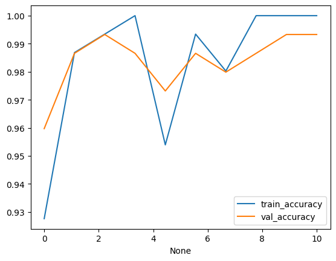

# The LLM model from scratch 
* This is my project where i show my core skills of understanding the work and flow of how llm works 
*  in model.py i generate the  all the components regarding to model like tranformer block , multihead attention ff layers all written and coded from scratch so this is the
* then i finetuned it for spam ham classfier and it worked well this is the graph
